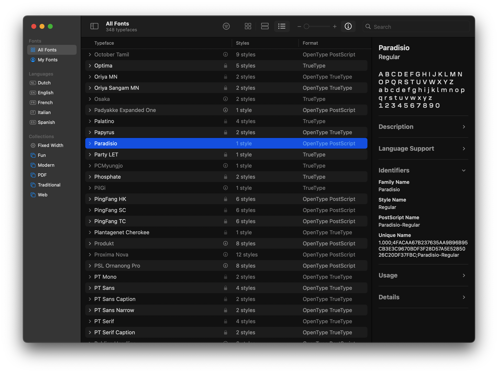

# FontFactory Contract

---

## [FontEngine Contract](./src/lib.rs)

---

1. Build and Deploy the Contract

    - You can automatically compile and deploy the contract in the NEAR testnet by running:

        ```bash
        ./deploy.sh
        ```

    - Once finished, check the `neardev/dev-account` file to find the address in which the contract was deployed:

        ```bash
        cat ./neardev/dev-account
        # e.g. dev-1667357419594-73844543672735
        ```

2. Check the Font ID with the view method `get_font_id`

    ```bash
    # Use near-cli to get the greeting
    near view <dev-account> get_font_id
    ```

    - Anyone can view

3. Mint a Font with the change method `create_custom_font`

    - It calls the font engine and runs it to an existing font
    - The new font will have a custom NAME ID 3 on the open type name table
        - This is a sha256 digest made from the sender address and the Font ID word you select
    - This method changes the contract's state
    - Just can be invoked with a NEAR account and paying gas

        ```bash
        near call <dev-account> create_custom_font '{"fontid":"MyFont"}' --accountId <dev-account>
        ```

4. Sign transaction

    - First login
        ```bash
        # Use near-cli to login your NEAR account
        near login
        ```
    - Sign the transaction: `--accountId <your-account>`.

5. Chack your font in your download folder
    - Open it in Font Book to check the unique identifier
      
